Penguin Dataset Exploratory Analysis
================
Carson Young
November 2023

# Correlation Matrix and Plots

``` r
head(penguins)
```

    ## # A tibble: 6 × 8
    ##   species island    bill_length_mm bill_depth_mm flipper_length_mm body_mass_g
    ##   <fct>   <fct>              <dbl>         <dbl>             <int>       <int>
    ## 1 Adelie  Torgersen           39.1          18.7               181        3750
    ## 2 Adelie  Torgersen           39.5          17.4               186        3800
    ## 3 Adelie  Torgersen           40.3          18                 195        3250
    ## 4 Adelie  Torgersen           NA            NA                  NA          NA
    ## 5 Adelie  Torgersen           36.7          19.3               193        3450
    ## 6 Adelie  Torgersen           39.3          20.6               190        3650
    ## # ℹ 2 more variables: sex <fct>, year <int>

``` r
glimpse(penguins)
```

    ## Rows: 344
    ## Columns: 8
    ## $ species           <fct> Adelie, Adelie, Adelie, Adelie, Adelie, Adelie, Adel…
    ## $ island            <fct> Torgersen, Torgersen, Torgersen, Torgersen, Torgerse…
    ## $ bill_length_mm    <dbl> 39.1, 39.5, 40.3, NA, 36.7, 39.3, 38.9, 39.2, 34.1, …
    ## $ bill_depth_mm     <dbl> 18.7, 17.4, 18.0, NA, 19.3, 20.6, 17.8, 19.6, 18.1, …
    ## $ flipper_length_mm <int> 181, 186, 195, NA, 193, 190, 181, 195, 193, 190, 186…
    ## $ body_mass_g       <int> 3750, 3800, 3250, NA, 3450, 3650, 3625, 4675, 3475, …
    ## $ sex               <fct> male, female, female, NA, female, male, female, male…
    ## $ year              <int> 2007, 2007, 2007, 2007, 2007, 2007, 2007, 2007, 2007…

``` r
# Correlation Matrix ------------------------------------------------------
library(corrr)
penguins_corr <- penguins %>%
  dplyr::select(body_mass_g, ends_with("_mm")) %>%
  correlate() %>%
  rearrange()
penguins_corr
```

    ## # A tibble: 4 × 5
    ##   term              flipper_length_mm body_mass_g bill_length_mm bill_depth_mm
    ##   <chr>                         <dbl>       <dbl>          <dbl>         <dbl>
    ## 1 flipper_length_mm            NA           0.871          0.656        -0.584
    ## 2 body_mass_g                   0.871      NA              0.595        -0.472
    ## 3 bill_length_mm                0.656       0.595         NA            -0.235
    ## 4 bill_depth_mm                -0.584      -0.472         -0.235        NA

``` r
autoplot(penguins_corr, triangular = "lower") + 
  labs(title = "Penguin size, Palmer Station LTER",
  subtitle = "Correlation Matrix",
)
```

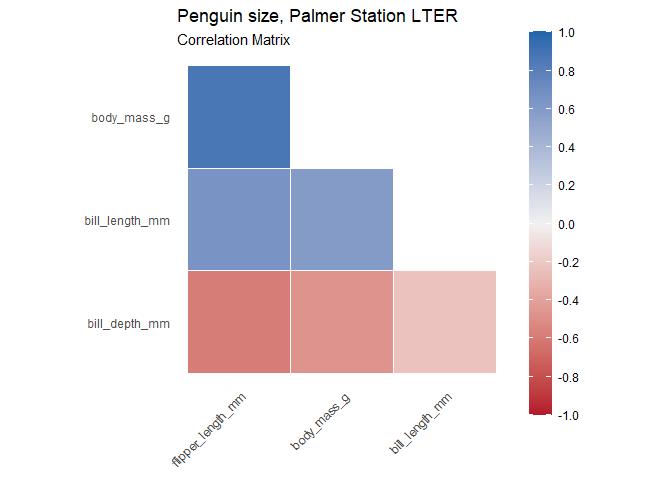<!-- -->

``` r
# Correlation Plots -------------------------------------------------------
penguins %>%
  select(species, body_mass_g, ends_with("_mm")) %>% 
  GGally::ggpairs(aes(color = species)) +
  scale_colour_manual(values = c("darkorange","purple","cyan4")) +
  scale_fill_manual(values = c("darkorange","purple","cyan4"))
```

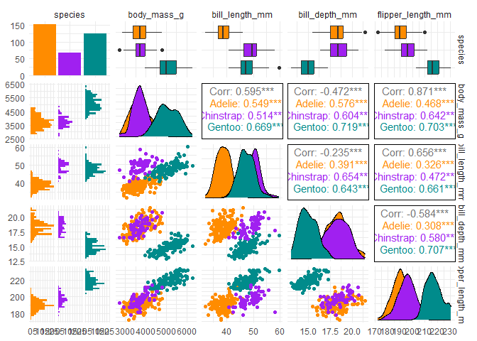<!-- -->

# Scatter Plots

``` r
# Example Scatter Plots ------------------------------------------------------
# Penguin mass vs. flipper length
mass_flipper <- ggplot(data = penguins, 
                       aes(x = flipper_length_mm,
                           y = body_mass_g)) +
  geom_point(aes(color = species, 
                 shape = species),
             size = 3,
             alpha = 0.8) +
  scale_color_manual(values = c("darkorange","purple","cyan4")) +
  labs(title = "Penguin size, Palmer Station LTER",
       subtitle = "Flipper length and body mass for Adelie, Chinstrap and Gentoo Penguins",
       x = "Flipper length (mm)",
       y = "Body mass (g)",
       color = "Penguin species",
       shape = "Penguin species") +
  theme(legend.position = c(0.2, 0.7),
        plot.title.position = "plot",
        plot.caption = element_text(hjust = 0, face= "italic"),
        plot.caption.position = "plot")

mass_flipper
```

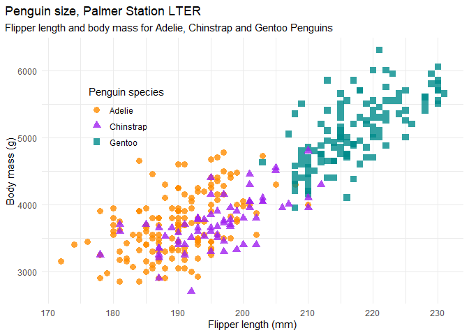<!-- -->

``` r
# Penguin mass vs. bill depth
mass_depth <- ggplot(data = penguins, 
                       aes(x = flipper_length_mm,
                           y = bill_depth_mm)) +
  geom_point(aes(color = species, 
                 shape = species),
             size = 3,
             alpha = 0.8) +
  scale_color_manual(values = c("darkorange","purple","cyan4")) +
  labs(title = "Penguin size, Palmer Station LTER",
       subtitle = "Flipper length and bill depth for Adelie, Chinstrap and Gentoo Penguins",
       x = "Bill depth (mm)",
       y = "Body mass (g)",
       color = "Penguin species",
       shape = "Penguin species") +
  theme(legend.position = c(0.85, 0.8),
        plot.title.position = "plot",
        plot.caption = element_text(hjust = 0, face= "italic"),
        plot.caption.position = "plot")

mass_depth
```

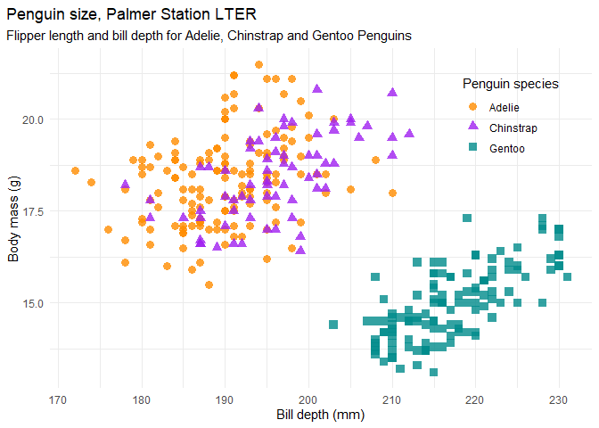<!-- -->

``` r
# Penguin mass vs. bill length
mass_length <- ggplot(data = penguins, 
                     aes(x = flipper_length_mm,
                         y = bill_length_mm)) +
  geom_point(aes(color = species, 
                 shape = species),
             size = 3,
             alpha = 0.8) +
  scale_color_manual(values = c("darkorange","purple","cyan4")) +
  labs(title = "Penguin size, Palmer Station LTER",
       subtitle = "Flipper length and bill length for Adelie, Chinstrap and Gentoo Penguins",
       x = "Bill length (mm)",
       y = "Body mass (g)",
       color = "Penguin species",
       shape = "Penguin species") +
  theme(legend.position = c(0.85, 0.8),
        plot.title.position = "plot",
        plot.caption = element_text(hjust = 0, face= "italic"),
        plot.caption.position = "plot")

mass_length 
```

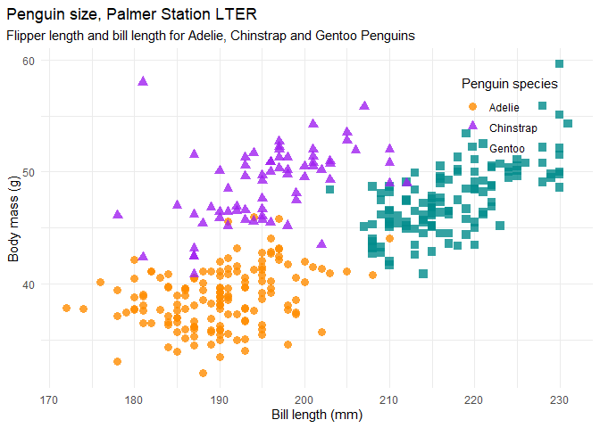<!-- -->

``` r
# Flipper length vs. bill length
flipper_bill <- ggplot(data = penguins,
                       aes(x = flipper_length_mm,
                           y = bill_length_mm)) +
  geom_point(aes(color = species, 
                 shape = species),
             size = 3,
             alpha = 0.8) +
  scale_color_manual(values = c("darkorange","purple","cyan4")) +
  labs(title = "Flipper and bill length",
       subtitle = "Dimensions for Adelie, Chinstrap and Gentoo Penguins at Palmer Station LTER",
       x = "Flipper length (mm)",
       y = "Bill length (mm)",
       color = "Penguin species",
       shape = "Penguin species") +
  theme(legend.position = c(0.85, 0.15),
        plot.title.position = "plot",
        plot.caption = element_text(hjust = 0, face= "italic"),
        plot.caption.position = "plot")

flipper_bill
```

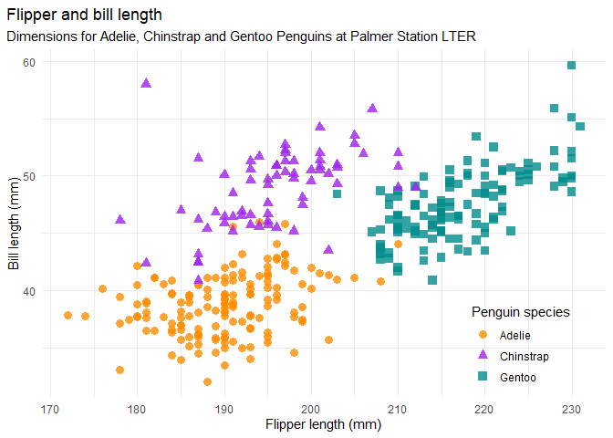<!-- -->

``` r
# Bill length vs. depth
bill_len_dep <- ggplot(data = penguins,
                       aes(x = bill_length_mm,
                           y = bill_depth_mm,
                           group = species)) +
  geom_point(aes(color = species, 
                 shape = species),
             size = 3,
             alpha = 0.8) +
  geom_smooth(method = "lm", se = FALSE, aes(color = species)) +
  scale_color_manual(values = c("darkorange","purple","cyan4")) +
  labs(title = "Penguin bill dimensions",
       subtitle = "Bill length and depth for Adelie, Chinstrap and Gentoo Penguins at Palmer Station LTER",
       x = "Bill length (mm)",
       y = "Bill depth (mm)",
       color = "Penguin species",
       shape = "Penguin species") +
  theme(legend.position = c(0.85, 0.15),
        plot.title.position = "plot",
        plot.caption = element_text(hjust = 0, face= "italic"),
        plot.caption.position = "plot")

bill_len_dep
```

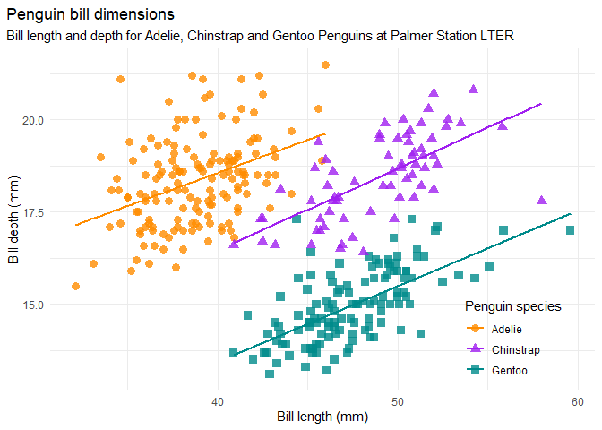<!-- -->

``` r
# Flipper length vs. bill depth
flipper_bill_depth <- ggplot(data = penguins,
                       aes(x = flipper_length_mm,
                           y = bill_depth_mm,
                           group = species)) +
  geom_point(aes(color = species, 
                 shape = species),
             size = 3,
             alpha = 0.8) +
  scale_color_manual(values = c("darkorange","purple","cyan4")) +
  labs(title = "Flipper and bill depth",
       subtitle = "Dimensions for Adelie, Chinstrap and Gentoo Penguins at Palmer Station LTER",
       x = "flipper_length_mm",
       y = "Bill depth (mm)",
       color = "Penguin species",
       shape = "Penguin species") +
  theme(legend.position = c(0.85, 0.15),
        plot.title.position = "plot",
        plot.caption = element_text(hjust = 0, face= "italic"),
        plot.caption.position = "plot")

flipper_bill_depth
```

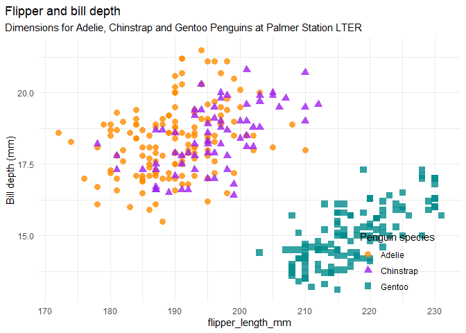<!-- -->

# Principal Componenet Analysis

``` r
# Principal component analysis --------------------------------------------
library(recipes)
penguin_recipe <-
  recipe(~., data = penguins) %>% 
  update_role(species, island, sex, year, new_role = "id") %>% 
  step_naomit(all_predictors()) %>% 
  step_normalize(all_predictors()) %>%
  step_pca(all_predictors(), id = "pca") %>% 
  prep()


# PCA variable loadings
penguin_pca <- 
  penguin_recipe %>% 
  tidy(id = "pca", type = "coef") 
penguin_pca
```

    ## # A tibble: 16 × 4
    ##    terms                value component id   
    ##    <chr>                <dbl> <chr>     <chr>
    ##  1 bill_length_mm     0.455   PC1       pca  
    ##  2 bill_depth_mm     -0.400   PC1       pca  
    ##  3 flipper_length_mm  0.576   PC1       pca  
    ##  4 body_mass_g        0.548   PC1       pca  
    ##  5 bill_length_mm    -0.597   PC2       pca  
    ##  6 bill_depth_mm     -0.798   PC2       pca  
    ##  7 flipper_length_mm -0.00228 PC2       pca  
    ##  8 body_mass_g       -0.0844  PC2       pca  
    ##  9 bill_length_mm    -0.644   PC3       pca  
    ## 10 bill_depth_mm      0.418   PC3       pca  
    ## 11 flipper_length_mm  0.232   PC3       pca  
    ## 12 body_mass_g        0.597   PC3       pca  
    ## 13 bill_length_mm     0.146   PC4       pca  
    ## 14 bill_depth_mm     -0.168   PC4       pca  
    ## 15 flipper_length_mm -0.784   PC4       pca  
    ## 16 body_mass_g        0.580   PC4       pca

``` r
# PCA variances
penguin_recipe %>% 
  tidy(id = "pca", type = "variance") 
```

    ## # A tibble: 16 × 4
    ##    terms                         value component id   
    ##    <chr>                         <dbl>     <int> <chr>
    ##  1 variance                      2.75          1 pca  
    ##  2 variance                      0.773         2 pca  
    ##  3 variance                      0.365         3 pca  
    ##  4 variance                      0.108         4 pca  
    ##  5 cumulative variance           2.75          1 pca  
    ##  6 cumulative variance           3.53          2 pca  
    ##  7 cumulative variance           3.89          3 pca  
    ##  8 cumulative variance           4             4 pca  
    ##  9 percent variance             68.8           1 pca  
    ## 10 percent variance             19.3           2 pca  
    ## 11 percent variance              9.13          3 pca  
    ## 12 percent variance              2.71          4 pca  
    ## 13 cumulative percent variance  68.8           1 pca  
    ## 14 cumulative percent variance  88.2           2 pca  
    ## 15 cumulative percent variance  97.3           3 pca  
    ## 16 cumulative percent variance 100             4 pca

``` r
# Plot PCA variances
penguin_recipe %>% 
  tidy(id = "pca", type = "variance") %>% 
  dplyr::filter(terms == "percent variance") %>% 
  ggplot(aes(x = component, y = value)) + 
  geom_col(fill = "#b6dfe2") + 
  xlim(c(0, 5)) + 
  labs(title = "PCA variances explained",
       y = ("% of total variance"))
```

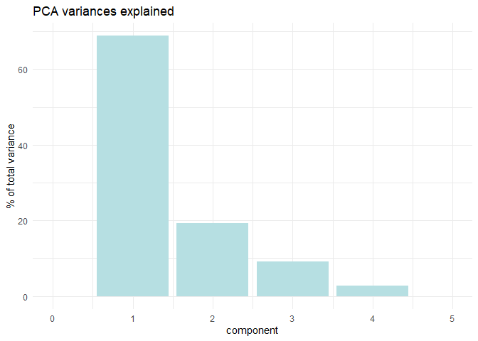<!-- -->

``` r
# Plot PCA loadings 
penguin_pca %>%
  mutate(terms = tidytext::reorder_within(terms, 
                                          abs(value), 
                                          component)) %>%
  ggplot(aes(abs(value), terms, fill = value > 0)) +
  geom_col() +
  facet_wrap(~component, scales = "free_y") +
  tidytext::scale_y_reordered() +
  scale_fill_manual(values = c("#b6dfe2", "#0A537D")) +
  labs(
    x = "Absolute value of contribution",
    y = NULL, fill = "Positive?"
  ) 
```

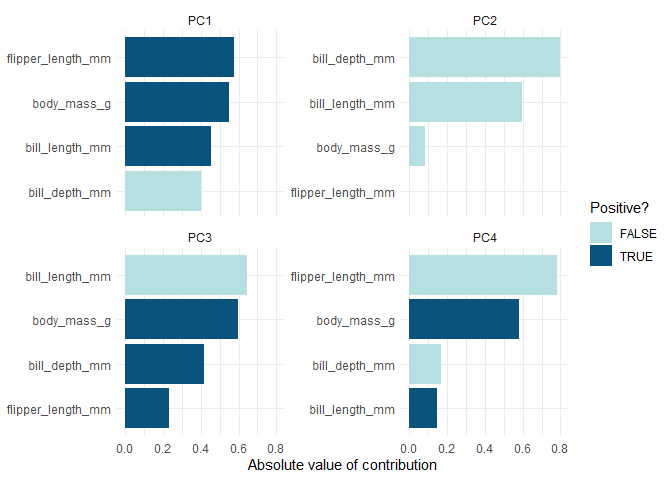<!-- -->

``` r
# get pca loadings into wider format
pca_wider <- penguin_pca %>% 
  tidyr::pivot_wider(names_from = component, id_cols = terms)

# define arrow style
arrow_style <- arrow(length = unit(.05, "inches"),
                     type = "closed")


pca_plot <-
  juice(penguin_recipe) %>%
  ggplot(aes(PC1, PC2)) +
  geom_point(aes(color = species, shape = species), 
             alpha = 0.8, 
             size = 2) +
  scale_colour_manual(values = c("darkorange","purple","cyan4")) 

pca_plot +
  geom_segment(data = pca_wider,
               aes(xend = PC1, yend = PC2), 
               x = 0, 
               y = 0, 
               arrow = arrow_style) + 
  geom_text(data = pca_wider,
            aes(x = PC1, y = PC2, label = terms), 
            hjust = 0, 
            vjust = 1,
            size = 5, 
            color = '#0A537D') 
```

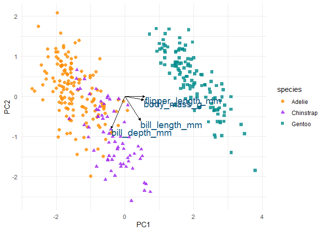<!-- -->

# Bibliography

Horst AM, Hill AP, Gorman KB (2020). palmerpenguins: Palmer Archipelago
(Antarctica) penguin data. R package version 0.1.0.
<https://allisonhorst.github.io/palmerpenguins/>. doi:
10.5281/zenodo.3960218.
