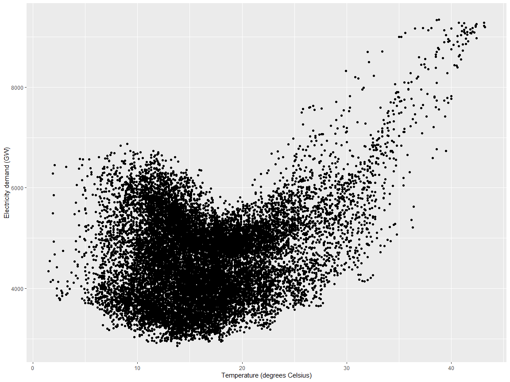

Forecasting Basics
================
*Carson Young*

February 2023

# Forecasting Introduction

Forecasting is about predicting the future as accurately as possible,
given all of the information available, including historical data and
knowledge of any future events that might impact the forecasts.

These notes are developed and adapted from Rob J Hyndman’s *Forecasting:
Principles and Practice*.

## `tsibble` objects

A dataframe where one column is time and used as an index. Extends the
standard `tibble` objects.

### `tsibble` basics

``` r
# create tsibble object
(y <- tsibble(
  Year = 2015:2019,
  Observation = c(123, 39, 78, 52, 110),
  index = Year
))
```

    ## # A tsibble: 5 x 2 [1Y]
    ##    Year Observation
    ##   <int>       <dbl>
    ## 1  2015         123
    ## 2  2016          39
    ## 3  2017          78
    ## 4  2018          52
    ## 5  2019         110

``` r
# create tibble object
(z <- tibble(
  Month = c("2019 Jan", "2019 Feb", "2019 Mar", "2019 Apr"),
  Observation = c(50,23,24,39),
))
```

    ## # A tibble: 4 × 2
    ##   Month    Observation
    ##   <chr>          <dbl>
    ## 1 2019 Jan          50
    ## 2 2019 Feb          23
    ## 3 2019 Mar          24
    ## 4 2019 Apr          39

``` r
# mutate tibble to tsibble 
z %>%
  mutate(Month = yearmonth(Month)) %>%
  as_tsibble(index = Month)
```

    ## # A tsibble: 4 x 2 [1M]
    ##      Month Observation
    ##      <mth>       <dbl>
    ## 1 2019 Jan          50
    ## 2 2019 Feb          23
    ## 3 2019 Mar          24
    ## 4 2019 Apr          39

Note the month column is converted from a text to a monthly time object.

## Olumpics Running Example

We can store multiple time series as a single `tsibble` object.

``` r
data(olympic_running)
olympic_running
```

    ## # A tsibble: 312 x 4 [4Y]
    ## # Key:       Length, Sex [14]
    ##     Year Length Sex    Time
    ##    <int>  <int> <chr> <dbl>
    ##  1  1896    100 men    12  
    ##  2  1900    100 men    11  
    ##  3  1904    100 men    11  
    ##  4  1908    100 men    10.8
    ##  5  1912    100 men    10.8
    ##  6  1916    100 men    NA  
    ##  7  1920    100 men    10.8
    ##  8  1924    100 men    10.6
    ##  9  1928    100 men    10.8
    ## 10  1932    100 men    10.3
    ## # … with 302 more rows

- \[4Y\] indicates the interval of these observations is every four
  years.
- There are 14 separate time series, see decompostition below.
- No olympics in 1916 due to World War I, see missing value.

``` r
olympic_running |> distinct(Sex)
```

    ## # A tibble: 2 × 1
    ##   Sex  
    ##   <chr>
    ## 1 men  
    ## 2 women

``` r
olympic_running |> distinct(Length)
```

    ## # A tibble: 7 × 1
    ##   Length
    ##    <int>
    ## 1    100
    ## 2    200
    ## 3    400
    ## 4    800
    ## 5   1500
    ## 6   5000
    ## 7  10000

So seven different length categories

## Sales of pharmaceutical products in Australia Example

``` r
data(PBS)
PBS
```

    ## # A tsibble: 67,596 x 9 [1M]
    ## # Key:       Concession, Type, ATC1, ATC2 [336]
    ##       Month Concession   Type        ATC1  ATC1_desc ATC2  ATC2_…¹ Scripts  Cost
    ##       <mth> <chr>        <chr>       <chr> <chr>     <chr> <chr>     <dbl> <dbl>
    ##  1 1991 Jul Concessional Co-payments A     Alimenta… A01   STOMAT…   18228 67877
    ##  2 1991 Aug Concessional Co-payments A     Alimenta… A01   STOMAT…   15327 57011
    ##  3 1991 Sep Concessional Co-payments A     Alimenta… A01   STOMAT…   14775 55020
    ##  4 1991 Oct Concessional Co-payments A     Alimenta… A01   STOMAT…   15380 57222
    ##  5 1991 Nov Concessional Co-payments A     Alimenta… A01   STOMAT…   14371 52120
    ##  6 1991 Dec Concessional Co-payments A     Alimenta… A01   STOMAT…   15028 54299
    ##  7 1992 Jan Concessional Co-payments A     Alimenta… A01   STOMAT…   11040 39753
    ##  8 1992 Feb Concessional Co-payments A     Alimenta… A01   STOMAT…   15165 54405
    ##  9 1992 Mar Concessional Co-payments A     Alimenta… A01   STOMAT…   16898 61108
    ## 10 1992 Apr Concessional Co-payments A     Alimenta… A01   STOMAT…   18141 65356
    ## # … with 67,586 more rows, and abbreviated variable name ¹​ATC2_desc

### `filter()` and `select()`

We can use the `filter()` function to extract the A10 scripts and the
relavent column we want:

``` r
PBS |>
  filter(ATC2 == "A10") |>
  select(Month, Concession, Type, Cost)
```

    ## # A tsibble: 816 x 4 [1M]
    ## # Key:       Concession, Type [4]
    ##       Month Concession   Type           Cost
    ##       <mth> <chr>        <chr>         <dbl>
    ##  1 1991 Jul Concessional Co-payments 2092878
    ##  2 1991 Aug Concessional Co-payments 1795733
    ##  3 1991 Sep Concessional Co-payments 1777231
    ##  4 1991 Oct Concessional Co-payments 1848507
    ##  5 1991 Nov Concessional Co-payments 1686458
    ##  6 1991 Dec Concessional Co-payments 1843079
    ##  7 1992 Jan Concessional Co-payments 1564702
    ##  8 1992 Feb Concessional Co-payments 1732508
    ##  9 1992 Mar Concessional Co-payments 2046102
    ## 10 1992 Apr Concessional Co-payments 2225977
    ## # … with 806 more rows

Note that the index variable `Month`, and the keys `Concession` and
`Type`, would be returned even if they were not explicitly selected as
they are required for a tsibble (to ensure each row contains a unique
combination of keys and index).

### `summarise()`

The new variable TotalC is the sum of all Cost values for each month.

``` r
PBS |>
  filter(ATC2 == "A10") |>
  select(Month, Concession, Type, Cost) |>
  summarise(TotalC = sum(Cost))
```

    ## # A tsibble: 204 x 2 [1M]
    ##       Month  TotalC
    ##       <mth>   <dbl>
    ##  1 1991 Jul 3526591
    ##  2 1991 Aug 3180891
    ##  3 1991 Sep 3252221
    ##  4 1991 Oct 3611003
    ##  5 1991 Nov 3565869
    ##  6 1991 Dec 4306371
    ##  7 1992 Jan 5088335
    ##  8 1992 Feb 2814520
    ##  9 1992 Mar 2985811
    ## 10 1992 Apr 3204780
    ## # … with 194 more rows

### `mutate()`

Here we change the units from dollars to millions of dollars:

``` r
PBS |>
  filter(ATC2 == "A10") |>
  select(Month, Concession, Type, Cost) |>
  summarise(TotalC = sum(Cost)) |>
  mutate(Cost = TotalC/1e6) ->a10
```

Note right assignment at the end stpres the resulting tsibble. Useful
operator after a long serires of piped functions.

### Reading a csv file and convert to a tsibble

``` r
prison <- readr::read_csv("https://OTexts.com/fpp3/extrafiles/prison_population.csv")
```

    ## Rows: 3072 Columns: 6
    ## ── Column specification ────────────────────────────────────────────────────────
    ## Delimiter: ","
    ## chr  (4): State, Gender, Legal, Indigenous
    ## dbl  (1): Count
    ## date (1): Date
    ## 
    ## ℹ Use `spec()` to retrieve the full column specification for this data.
    ## ℹ Specify the column types or set `show_col_types = FALSE` to quiet this message.

``` r
prison <- prison %>%
  mutate(Quarter = yearquarter(Date)) %>%
  select(-Date) %>%
  as_tsibble(key = c(State, Gender, Legal, Indigenous),
             index = Quarter)
prison
```

    ## # A tsibble: 3,072 x 6 [1Q]
    ## # Key:       State, Gender, Legal, Indigenous [64]
    ##    State Gender Legal    Indigenous Count Quarter
    ##    <chr> <chr>  <chr>    <chr>      <dbl>   <qtr>
    ##  1 ACT   Female Remanded ATSI           0 2005 Q1
    ##  2 ACT   Female Remanded ATSI           1 2005 Q2
    ##  3 ACT   Female Remanded ATSI           0 2005 Q3
    ##  4 ACT   Female Remanded ATSI           0 2005 Q4
    ##  5 ACT   Female Remanded ATSI           1 2006 Q1
    ##  6 ACT   Female Remanded ATSI           1 2006 Q2
    ##  7 ACT   Female Remanded ATSI           1 2006 Q3
    ##  8 ACT   Female Remanded ATSI           0 2006 Q4
    ##  9 ACT   Female Remanded ATSI           0 2007 Q1
    ## 10 ACT   Female Remanded ATSI           1 2007 Q2
    ## # … with 3,062 more rows

This tsibble contains 64 separate time series corresponding to the
combinations of the 8 states, 2 genders, 2 legal statuses and 2
indigenous statuses. Each of these series is 48 observations in length,
from 2005 Q1 to 2016 Q4.

For a tsibble to be valid, it requires a unique index for each
combination of keys.

# Time series graphics

## Time plots

``` r
data(ansett)
melsyd_economy <- ansett |>
  filter(Airports == "MEL-SYD", Class == "Economy") |>
  mutate(Passengers = Passengers/1000)
autoplot(melsyd_economy, Passengers) +
  labs(title = "Ansett airlines economy class",
       subtitle = "Melbourne-Sydney",
       y = "Passengers ('000)")
```

<!-- -->
`autoplot()` automatically produces an appropriate plot of whatever you
pass to it in the first argument.

``` r
autoplot(a10, Cost) +
  labs(y = "$ (millions)",
       title = "Australian antidiabetic drug sales")
```

<!-- -->
Here, there is a clear and increasing trend. There is also a strong
seasonal pattern that increases in size as the level of the series
increases. The sudden drop at the start of each year is caused by a
government subsidisation scheme that makes it cost-effective for
patients to stockpile drugs at the end of the calendar year. Any
forecasts of this series would need to capture the seasonal pattern, and
the fact that the trend is changing slowly.

## Seasonal Plots

``` r
a10 |>
  gg_season(Cost, labels = "both") +
  labs(y = "$ (millions)",
       title = "Seasonal plot: Antidiabetic drug sales")
```

<!-- -->
Clear that there is a large jump in sales in January each year.
Actually, these are probably sales in late December as customers
stockpile before the end of the calendar year, but the sales are not
registered with the government until a week or two later

``` r
data(vic_elec)

# demand is a column in vic_elec dataframe
vic_elec |> gg_season(Demand, period = "day") +
  theme(legend.position = "none") +
  labs(y="MWh", title="Electricity demand: Victoria")
```

<!-- -->

``` r
vic_elec |> gg_season(Demand, period = "week") +
  theme(legend.position = "none") +
  labs(y="MWh", title="Electricity demand: Victoria")
```

<!-- -->

``` r
vic_elec |> gg_season(Demand, period = "year") +
  labs(y="MWh", title="Electricity demand: Victoria")
```

<!-- -->
\## Scatter plots

``` r
vic_elec |>
  filter(year(Time) == 2014) |>
  autoplot(Demand) +
  labs(y = "GW",
       title = "Half-hourly electricity demand: Victoria")
```

<!-- -->

``` r
vic_elec |>
  filter(year(Time) == 2014) |>
  autoplot(Temperature) +
  labs(
    y = "Degrees Celsius",
    title = "Half-hourly temperatures: Melbourne, Australia"
  )
```

<!-- -->

``` r
vic_elec |>
  filter(year(Time) == 2014) |>
  ggplot(aes(x = Temperature, y = Demand)) +
  geom_point() +
  labs(x = "Temperature (degrees Celsius)",
       y = "Electricity demand (GW)")
```

<!-- -->

## Scatterplot matricies

``` r
data(tourism)
visitors <- tourism |>
  group_by(State) |>
  summarise(Trips = sum(Trips))
visitors |>
  ggplot(aes(x = Quarter, y = Trips)) +
  geom_line() +
  facet_grid(vars(State), scales = "free_y") +
  labs(title = "Australian domestic tourism",
       y= "Overnight trips ('000)")
```

<!-- -->

``` r
library(GGally)
```

    ## Registered S3 method overwritten by 'GGally':
    ##   method from   
    ##   +.gg   ggplot2

``` r
visitors |>
  pivot_wider(values_from=Trips, names_from=State) |>
  GGally::ggpairs(columns = 2:9)
```

<!-- -->

# Time series decomposition

## Transformations and adjustments

### Population adjustments

``` r
global_economy |>
  filter(Country == "Australia") |>
  autoplot(GDP/Population) +
  labs(title= "GDP per capita", y = "$US")
```

<!-- -->

### Inflation adjustments

``` r
print_retail <- aus_retail |>
  filter(Industry == "Newspaper and book retailing") |>
  group_by(Industry) |>
  index_by(Year = year(Month)) |>
  summarise(Turnover = sum(Turnover))
aus_economy <- global_economy |>
  filter(Code == "AUS")

print_retail |>
  left_join(aus_economy, by = "Year") |>
  mutate(Adjusted_turnover = Turnover / CPI * 100) |>
  pivot_longer(c(Turnover, Adjusted_turnover),
               values_to = "Turnover") |>
  mutate(name = factor(name,
         levels=c("Turnover","Adjusted_turnover"))) |>
  ggplot(aes(x = Year, y = Turnover)) +
  geom_line() +
  facet_grid(name ~ ., scales = "free_y") +
  labs(title = "Turnover: Australian print media industry",
       y = "$AU")
```

    ## Warning: Removed 1 row containing missing values (`geom_line()`).

<!-- -->
Adjusted figures show Australia’s newspaper and book retailing industry
has been in decline much longer than the original data suggests.

## Time series components

Additive decomposition

$$y_t = S_t + T_t + R_t$$

Multiplicative decomposition

$$y_t = S_t \times T_t \times R_t$$

where $y_t$ is the data, $S_t$ is the seasonal component, $T_t$ is the
trend-cycle component, and  
$R_t$ is the remainder component, all at period $t$.

## Example: Employment in the US retail sector

``` r
data("us_employment")
us_retail_employment <- us_employment |>
  filter(year(Month) >= 1990, Title == "Retail Trade") |>
  select(-Series_ID)
autoplot(us_retail_employment, Employed) +
  labs(y = "Persons (thousands)",
       title = "Total employment in US retail")
```

<!-- -->
Try STL decomposition method.

## STL decomposition

``` r
dcmp <- us_retail_employment |>
  model(stl = STL(Employed))
components(dcmp)
```

    ## # A dable: 357 x 7 [1M]
    ## # Key:     .model [1]
    ## # :        Employed = trend + season_year + remainder
    ##    .model    Month Employed  trend season_year remainder season_adjust
    ##    <chr>     <mth>    <dbl>  <dbl>       <dbl>     <dbl>         <dbl>
    ##  1 stl    1990 Jan   13256. 13288.      -33.0      0.836        13289.
    ##  2 stl    1990 Feb   12966. 13269.     -258.     -44.6          13224.
    ##  3 stl    1990 Mar   12938. 13250.     -290.     -22.1          13228.
    ##  4 stl    1990 Apr   13012. 13231.     -220.       1.05         13232.
    ##  5 stl    1990 May   13108. 13211.     -114.      11.3          13223.
    ##  6 stl    1990 Jun   13183. 13192.      -24.3     15.5          13207.
    ##  7 stl    1990 Jul   13170. 13172.      -23.2     21.6          13193.
    ##  8 stl    1990 Aug   13160. 13151.       -9.52    17.8          13169.
    ##  9 stl    1990 Sep   13113. 13131.      -39.5     22.0          13153.
    ## 10 stl    1990 Oct   13185. 13110.       61.6     13.2          13124.
    ## # … with 347 more rows

``` r
components(dcmp) |>
  as_tsibble() |>
  autoplot(Employed, colour="gray") +
  geom_line(aes(y=trend), colour = "#D55E00") +
  labs(
    y = "Persons (thousands)",
    title = "Total employment in US retail"
  )
```

<!-- -->

``` r
components(dcmp) |> autoplot(colour = "#02597D")
```

<!-- -->
STL has several advantages over classical decomposition, and the SEATS
and X-11 methods described later:

- Unlike SEATS and X-11, STL will handle any type of seasonality, not
  only monthly and quarterly data.
- The seasonal component is allowed to change over time, and the rate of
  change can be controlled by the user.
- The smoothness of the trend-cycle can also be controlled by the user.
- It can be robust to outliers (i.e., the user can specify a robust
  decomposition), so that occasional unusual observations will not
  affect the estimates of the trend-cycle and seasonal components. They
  will, however, affect the remainder component.

### Seasonally adjusted data

If we remove seasonal component from the original data, the resulting
values are “seasonally adjusted”.

For the additive decomposition, this is simply $y_t-S_t$. i.e we only
consider $T_t + R_t$

``` r
components(dcmp) |>
  as_tsibble() |>
  autoplot(Employed, colour = "gray") +
  geom_line(aes(y=season_adjust), colour = "#0072B2") +
  labs(y = "Persons (thousands)",
       title = "Total employment in US retail")
```

<!-- -->
Useful technique when variation due to seasonality is not of primary
interest. For example, monthly unemployment data are usually seasonally
adjusted in order to highlight variation due to the underlying state of
the economy rather than the seasonal variation.

## Moving average smoothing

A moving average of order $m$ can be written as

$$\hat{T_t} = \frac{1}{m}  \sum_{j = -k}^{k} y_{t+j} $$

where $m = 2k + 1$

The estimate of the trend-cycle at time $t$ is obtained by averaging
values of the time series within $k$ periods of $t$. Observations that
are nearby in time are also likely to be close in value. Therefore, the
average eliminates some of the randomness in the data, leaving a smooth
trend-cycle component, denoted by $m-\textbf{MA}$(moving avg of order
$m$).

### Example Total Australian Exports

``` r
global_economy |>
  filter(Country == "Australia") |>
  autoplot(Exports) +
  labs(y = "% of GDP", title = "Total Australian exports")
```

<!-- -->
Compute moving average of order 5 `slider` packages

``` r
library(slider)

aus_exports <- global_economy |>
  filter(Country == "Australia") |>
  mutate(
    `5-MA` = slider::slide_dbl(Exports, mean,
                .before = 2, .after = 2, .complete = TRUE)
  )

aus_exports |>
  autoplot(Exports) +
  geom_line(aes(y = `5-MA`), colour = "#D55E00") +
  labs(y = "% of GDP",
       title = "Total Australian exports with 5-MA estimate") +
  guides(colour = guide_legend(title = "series"))
```

    ## Warning: Removed 4 rows containing missing values (`geom_line()`).

<!-- -->

``` r
aus_exports <- global_economy |>
  filter(Country == "Australia") |>
  mutate(
    `9-MA` = slider::slide_dbl(Exports, mean,
                .before = 4, .after = 4, .complete = TRUE)
  )

aus_exports |>
  autoplot(Exports) +
  geom_line(aes(y = `9-MA`), colour = "#D55E00") +
  labs(y = "% of GDP",
       title = "Total Australian exports with 9-MA estimate") +
  guides(colour = guide_legend(title = "series"))
```

    ## Warning: Removed 8 rows containing missing values (`geom_line()`).

<!-- -->
The order of the moving average determines the smoothness of the
trend-cycle estimate. In general, a larger order means a smoother curve.

#### Moving averages of moving averages

Consider $2 \times 4-\textbf{MA}$. i.e we apply $2-\textbf{MA}$ to the
$4-\textbf{MA}$

$$
\begin{aligned}
\hat{T_t} &=\frac{1}{2} \left[\frac{1}{4}(y_{t-2}+y_{t-1}+y_t+y_{t+1}) + \frac{1}{4}(y_{t-1}+y_{t}+y_{t+1}+y_{t+2})\right]\\
&= \frac{1}{8}y_{t-2}+\frac{1}{4}y_{t-1}+\frac{1}{4}y_t+\frac{1}{4}y_{t+1}+\frac{1}{8}y_{t+2}
\end{aligned}
$$

``` r
us_retail_employment_ma <- us_retail_employment |>
  mutate(
    `12-MA` = slider::slide_dbl(Employed, mean,
                .before = 5, .after = 6, .complete = TRUE),
    `2x12-MA` = slider::slide_dbl(`12-MA`, mean,
                .before = 1, .after = 0, .complete = TRUE)
  )
us_retail_employment_ma |>
  autoplot(Employed, colour = "gray") +
  geom_line(aes(y = `2x12-MA`), colour = "#D55E00") +
  labs(y = "Persons (thousands)",
       title = "Total employment in US retail")
```

    ## Warning: Removed 12 rows containing missing values (`geom_line()`).

<!-- -->
\## Classical decomposition

``` r
us_retail_employment |>
  model(
    classical_decomposition(Employed, type = "additive")
  ) |>
  components() |>
  autoplot() +
  labs(title = "Classical additive decomposition of total
                  US retail employment")
```

    ## Warning: Removed 6 rows containing missing values (`geom_line()`).

<!-- -->

## X-11 method

X-11 uses a multiplicative decomposition, whereas the STL and classical
decompositions are additive.

``` r
library(seasonal)
```

    ## 
    ## Attaching package: 'seasonal'

    ## The following object is masked from 'package:tibble':
    ## 
    ##     view

``` r
x11_dcmp <- us_retail_employment |>
  model(x11 = X_13ARIMA_SEATS(Employed ~ x11())) |>
  components()
autoplot(x11_dcmp) +
  labs(title =
    "Decomposition of total US retail employment using X-11.")
```

<!-- -->
The X-11 trend-cycle has captured the sudden fall in the data due to the
2007–2008 global financial crisis better than either of the other two
methods (where the effect of the crisis has leaked into the remainder
component)

``` r
x11_dcmp |>
  ggplot(aes(x = Month)) +
  geom_line(aes(y = Employed, colour = "Data")) +
  geom_line(aes(y = season_adjust,
                colour = "Seasonally Adjusted")) +
  geom_line(aes(y = trend, colour = "Trend")) +
  labs(y = "Persons (thousands)",
       title = "Total employment in US retail") +
  scale_colour_manual(
    values = c("gray", "#0072B2", "#D55E00"),
    breaks = c("Data", "Seasonally Adjusted", "Trend")
  )
```

<!-- -->
The seasonally adjusted data is very similar to the trend-cycle
component in this example, so it is hard to distinguish them on the
plot.

## SEATS method

Seasonal Extraction in ARIMA Time Series (SEATS)

``` r
seats_dcmp <- us_retail_employment |>
  model(seats = X_13ARIMA_SEATS(Employed ~ seats())) |>
  components()
autoplot(seats_dcmp) +
  labs(title =
    "Decomposition of total US retail employment using SEATS")
```

<!-- -->

# Bibliography

Hyndman, R. J., & Athanasopoulos, G. (2018). *Forecasting: principles
and practice*. OTexts.
